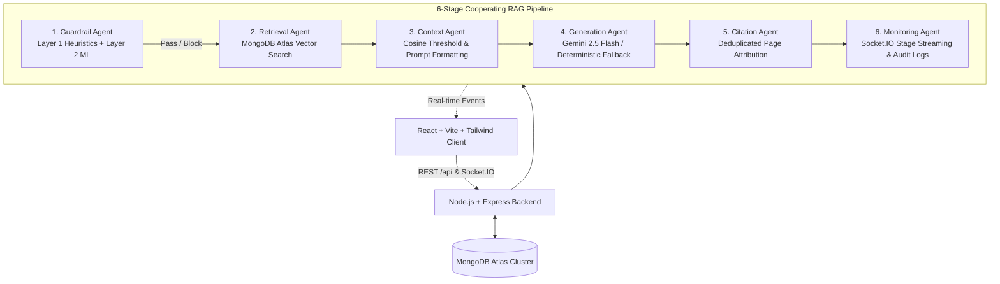

# CampusMind - Grounded College Chatbot Platform

CampusMind is an enterprise-grade, full-stack RAG (Retrieval-Augmented Generation) college help-desk chatbot. It enables students to query official college documents (regulations, fee structures, notices, hostel policies) in natural language while strictly guaranteeing factual grounding, zero hallucinations, source page citations, and multi-layer prompt-injection defense.

### 🌐 Live Production Deployment
- **Frontend (Vercel)**: [https://campusmind-client.vercel.app](https://campusmind-client.vercel.app)
- **Backend API (Render)**: [https://campusmind-backend-lfm9.onrender.com](https://campusmind-backend-lfm9.onrender.com)
- **Health Endpoint**: [https://campusmind-backend-lfm9.onrender.com/api/health](https://campusmind-backend-lfm9.onrender.com/api/health)

---

## 🏛️ System Architecture



---

## ✨ Key Features

- **🛡️ Multi-Layer Standalone Guardrail Layer**:
  - **Layer 1 (Rule-Based Heuristics)**: Detects instruction-overrides, system prompt leak attempts, role-play jailbreaks (DAN, Developer Mode), and Base64 encoded attacks.
  - **Layer 2 (Probabilistic ML Classifier)**: JS-native Bayes/TF-IDF classifier scoring inputs and flagging adversarial attempts above a confidence threshold.
  - Zero framework dependencies; completely evaluable standalone via CLI (`npm run test:guardrail`).

- **🔎 MongoDB Atlas Vector Search**:
  - Direct 3072-dimensional cosine vector embeddings (`gemini-embedding-001`) indexed natively in MongoDB Atlas with metadata filtering by document ID.
  - In-memory cosine search fallback for local testing.

- **🤖 Dual AI Provider Architecture**:
  - **Primary**: Google Generative AI SDK (`gemini-2.5-flash` & `gemini-embedding-001`).
  - **Offline/Deterministic Fallback**: Keyword/BM25 sentence extractive responder when `GEMINI_API_KEY` is not provided.

- **📡 Real-Time Socket.IO Pipeline Telemetry**:
  - Emits granular stage-by-stage events (`guardrail` $\rightarrow$ `retrieval` $\rightarrow$ `context` $\rightarrow$ `generation` $\rightarrow$ `citation` $\rightarrow$ `monitoring`) live to the client UI.

- **📑 Strict Document Citations & Refusals**:
  - Every factual response attributes the exact document filename and page number.
  - Explicit refusal (`NO_RELEVANT_CONTEXT`) when questions fall outside the knowledge base.

- **📂 Complete Admin Document Management & Ingestion**:
  - Drag-and-drop document upload with PDF parsing, text extraction, sentence-boundary chunking, and batch vector generation.
  - Cascading deletion of documents and all related vector chunks.
  - Admin audit logs and notification drawer with unread badges.

---

## 🚀 Getting Started

### Prerequisites
- Node.js $\ge$ v18.0.0
- npm $\ge$ v9.0.0

### 1. Clone & Install Dependencies
```bash
git clone https://github.com/anjithscse-arch/Nxtwave_AI_Workflow.git
cd Nxtwave_AI_Workflow

# Install dependencies for both server and client
npm run install:all
```

### 2. Environment Configuration
Copy the template from `server/.env.example` to `server/.env`:
```bash
cp server/.env.example server/.env
```

The configuration template includes all supported settings:
```env
PORT=5000
NODE_ENV=development
CLIENT_URL=http://localhost:5173
JWT_SECRET=your-secure-jwt-secret
JWT_EXPIRES_IN=7d

# MongoDB Atlas URI (or leave blank for embedded memory fallback)
MONGODB_URI=mongodb+srv://<username>:<password>@cluster.mongodb.net/campusmind?retryWrites=true&w=majority

# Background Queue (or leave blank for in-memory queue fallback)
REDIS_URL=redis://localhost:6379

# Google AI Studio API Key (or leave blank for deterministic fallback)
GEMINI_API_KEY=your_gemini_api_key
GEMINI_MODEL=gemini-2.5-flash
GEMINI_EMBEDDING_MODEL=gemini-embedding-001

# Pipeline Config
SIMILARITY_THRESHOLD=0.35
TOP_K=5
GUARDRAIL_CONFIDENCE_THRESHOLD=0.70
```

### 3. Run Development Servers
```bash
# Terminal 1: Backend Server (http://localhost:5000)
npm run dev:server

# Terminal 2: Frontend Client (http://localhost:5173)
npm run dev:client
```

---

## 🧪 Testing & Verification

```bash
# Run Standalone Guardrail Evaluator (19 test cases)
npm run test:guardrail

# Run End-to-End API and Pipeline Suite
npm run test:e2e

# Run Comprehensive Live Audit (Atlas + Gemini + Ingestion + Sockets)
npm run test:audit
```

---

## 👥 Seeded Evaluation Credentials

The following seeded accounts are provided for local development and test evaluation:
- **Admin**: `admin.dev@campusmind.internal` / `CampusAdmin#Secure2026!`
- **Student**: `student.dev@campusmind.internal` / `CampusStudent#Secure2026!`

> [!WARNING]
> **Production Security Notice**: These default credentials are strictly intended for offline development, local demonstration, and evaluation testing. In any production environment, ensure default test accounts are deleted, passwords rotated immediately, and new accounts created via the standard `/api/auth/register` flow.

---

## 📄 License
MIT License.

